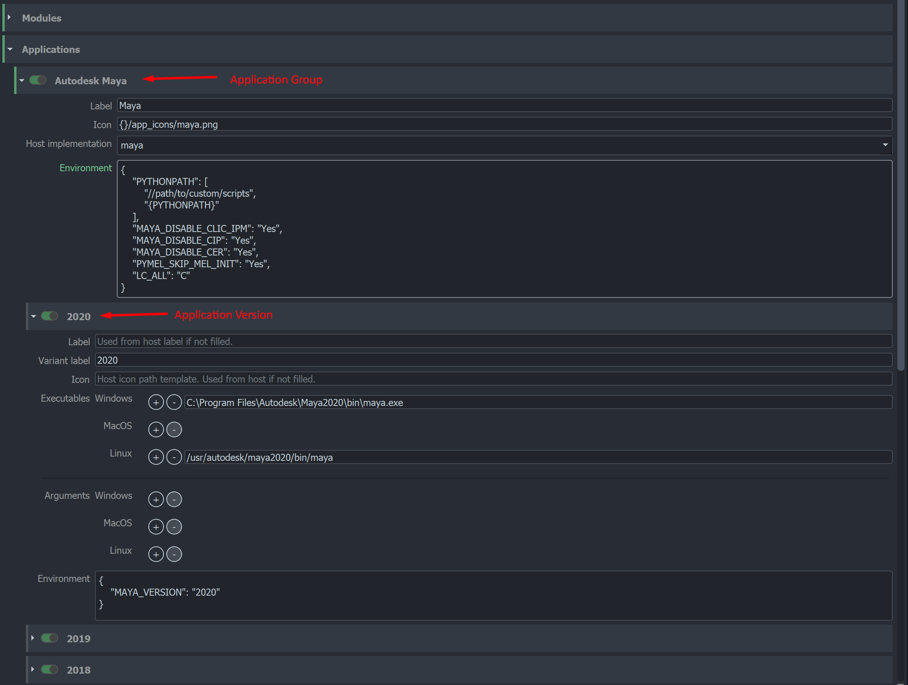
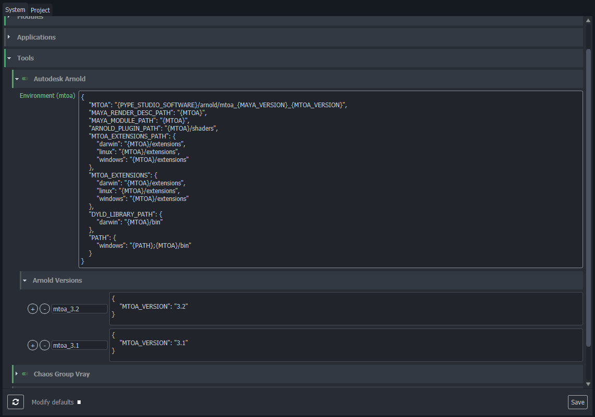

import Tabs from '@theme/Tabs';
import TabItem from '@theme/TabItem';

## Global

Settings applicable to the full studio.

`Studio Name`

`Studio Code`

`Environment`

## Modules

Configuration of OpenPype modules. Some can only be turned on and off, others have
their own attributes that need to be set, before they become fully functional.

### Avalon

`Avalon Mongo Timeout` - You might need to change this if your mongo connection is a bit slow. Making the 
timeout longer will give Avalon better chance to connect.

`Thumbnail Storage Location` - simple disk storage path, where all thumbnails will be stored. 

### Ftrack

`Server` - URL of your ftrack server.

Additional Action paths

`Action paths` - Directories containing your custom ftrack actions.

`Event paths` - Directories containing your custom ftrack event plugins.

`Intent` - Special ftrack attribute that mark the intention of individual publishes. This setting will be reflected
in publisher as well as ftrack custom attributes

`Custom Attributes` - Write and Read permissions for all OpenPype required ftrack custom attributes. The values should be
ftrack roles names.

### Sync Server

Disable/Enable OpenPype site sync feature

### Standalone Publisher

Disable/Enable Standalone Publisher option

### Deadline

`Deadline Rest URL` - URL to deadline webservice that. This URL must be reachable from every 
workstation that should be submitting render jobs to deadline via OpenPype.

### Muster

`Muster Rest URL` - URL to Muster webservice that. This URL must be reachable from every 
workstation that should be submitting render jobs to muster via OpenPype.

`templates mapping` - you can customize Muster templates to match your existing setup here. 

### Clockify

`Workspace Name` - name of the clockify workspace where you would like to be sending all the timelogs.

### Timers Manager

`Max Idle Time` - Duration (minutes) of inactivity, after which currently running timer will be stopped.

`Dialog popup time` - Time in minutes, before the end of Max Idle ti, when a notification will alert 
the user that their timer is about to be stopped.

### Idle Manager

Service monitoring the activity, which triggers the Timers Manager timeouts.

### Logging 

Module that allows storing all logging into the database for easier retrieval and support.

## Applications

In this section you can manage what Applications are available to your studio, locations of their 
executables and their additional environments. 

Each DCC is made of two levels. 
1. **Application group** - This is the main name of the application and you can define extra environments
that are applicable to all version of the give application. For example any extra Maya scripts that are not
version dependant, can be added to `Maya` environment here.
2. **Application versions** - Here you can define executables (per platform) for each supported version of 
the DCC and any default arguments (`--nukex` for instance). You can also further extend it's environment. 



Please keep in mind that the environments are not additive by default, so if you are extending variables like 
`PYTHONPATH`, or `PATH` make sure that you add themselves to the end of the list. 

For instance:

```json
{
    "PYTHONPATH": [
        "my/path/to/python/scripts",
        "{PYTHONPATH}"
    ]
}
```


## Tools

A tool in openPype is anything that needs to be selectively added to your DCC applications. Most often these are plugins, modules, extensions or similar depending on what your package happens to call it. 

OpenPype comes with some major CG renderers pre-configured as an example, but these and any others will need to be changed to match your particular environment.

Their environment settings are split to two levels just like applications to allow more flexibility when setting them up. 

In the image before you can see that we set most of the environment variables in the general MTOA level, and only specify the version variable in the individual versions below. Because all environments within pype setting will resolve any cross references, this is enough to get a fully dynamic plugin loading as far as your folder structure where you store the plugins is nicely organized. 


In this example MTOA will automatically will the `MAYA_VERSION`(which is set by Maya Application environment) and `MTOA_VERSION` into the `MTOA` variable. We then use the `MTOA` to set all the other variables needed for it to function within Maya. 


All of the tools defined in here can then be assigned to projects. You can also change the tools versions on any project level all the way down to individual asset or shot overrides. So if you just need to upgrade you render plugin for a single shot, while not risking the incompatibilities on the rest of the project, it is possible.