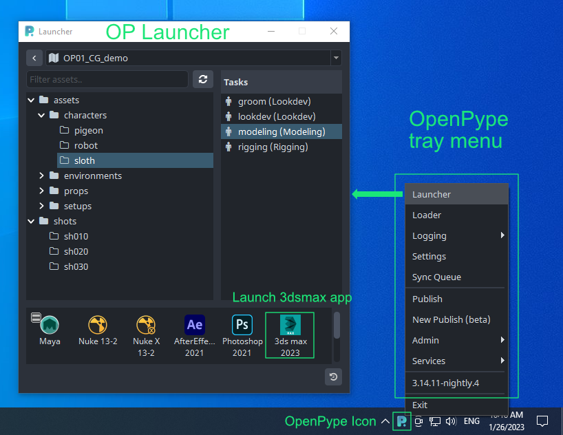
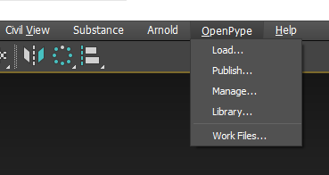
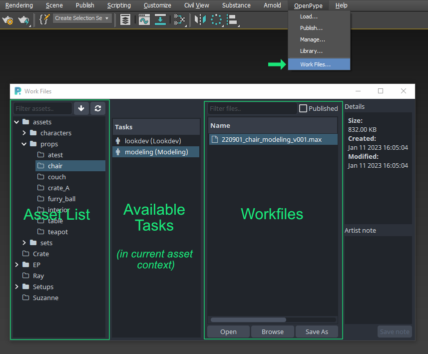
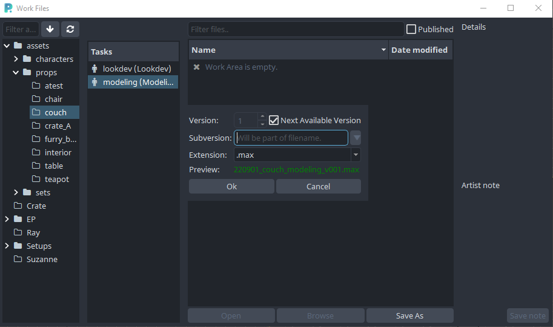
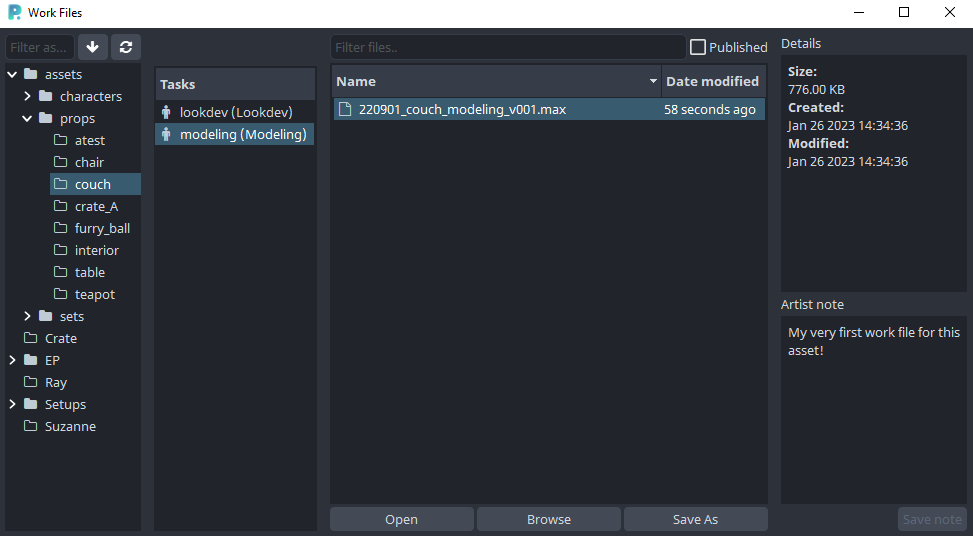
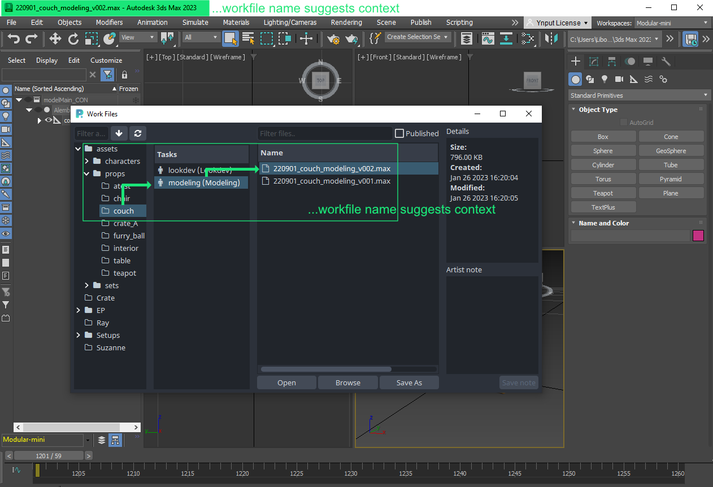

:::note Work in progress
This part of documentation is still work in progress.
:::

<!-- ## OpenPype Global Tools

-   [Set Context](artist_tools_context_manager)
-   [Work Files](artist_tools_workfiles)
-   [Create](artist_tools_creator)
-   [Load](artist_tools_loader)
-   [Manage (Inventory)](artist_tools_inventory)
-   [Publish](artist_tools_publisher)
-   [Library Loader](artist_tools_library_loader)
-->


## First Steps With OpenPype

Locate **OpenPype Icon** in the OS tray (if hidden dive in the tray toolbar).

> If you cannot locate the OpenPype icon ...it is not probably running so check [Getting Started](artist_getting_started.md) first.

By clicking the icon  ```OpenPype Menu``` rolls out.

Choose ```OpenPype Menu > Launcher``` to open the ```Launcher``` window.

When opened you can **choose** the **project** to work in from the list. Then choose the particular **asset** you want to work on then choose **task** 
and finally **run 3dsmax by its icon** in the tools.



:::note Launcher Content
The list of available projects, assets, tasks and tools will differ according to your Studio and need to be set in advance by supervisor/admin.
:::

## Running in the 3dsmax

If 3dsmax has been launched via OP Launcher there should be **OpenPype Menu** visible in 3dsmax **top header** after start.
This is the core functional area for you as a user. Most of your actions will take place here.



:::note OpenPype Menu
User should use this menu exclusively for **Opening/Saving** when dealing with work files not standard ```File Menu``` even though user still being able perform file operations via this menu but prefferably just performing quick saves during work session not saving actual workfile versions.
:::

## Working With Scene Files

In OpenPype menu first go to ```Work Files``` menu item so **Work Files  Window** shows up.

 Here you can perform Save / Load actions as you would normally do with ```File Save ``` and ```File Open``` in the standard 3dsmax ```File Menu``` and navigate to different project components like assets, tasks, workfiles etc.




You first choose particular asset and assigned task and corresponding workfile you would like to open.

If not any workfile present simply hit ```Save As``` and keep ```Subversion``` empty and hit ```Ok```.



OpenPype correctly names it and add version to the workfile. This basically happens whenever user trigger ```Save As``` action. Resulting into incremental version numbers like 

```workfileName_v001```

```workfileName_v002```

 etc. 

Basically meaning user is free of guessing what is the correct naming and other neccessities to keep everthing in order and managed.

> Note: user still has also other options for naming like ```Subversion```, ```Artist's Note``` but we won't dive into those now.

Here you can see resulting work file after ```Save As``` action.



## Understanding Context

As seen on our example OpenPype created pretty first workfile and named it ```220901_couch_modeling_v001.max``` meaning it sits in the Project ```220901``` being it ```couch``` asset and workfile being ```modeling``` task and obviously ```v001``` telling user its first existing version of this workfile.

It is good to be aware that whenever you as a user choose ```asset``` and ```task``` you happen to be in so called **context** meaning that all user actions are in relation with particular ```asset```. This could be quickly seen in host application header and ```OpenPype Menu``` and its accompanying tools.



> Whenever you choose different ```asset``` and its ```task``` in **Work Files window** you are basically changing context to the current asset/task you have chosen.


This concludes the basics of working with workfiles in 3dsmax using OpenPype and its tools. Following chapters will cover other aspects like creating multiple assets types and their publishing for later usage in the production.

---

## Creating and Publishing Instances

:::warning Important
Before proceeding further please check [Glossary](artist_concepts.md) and [What Is Publishing?](artist_publish.md) So you have clear idea about terminology.
:::


### Intro

Current OpenPype integration (ver 3.15.0) supports only ```PointCache``` and ```Camera``` families now.

**Pointcache** family being basically any geometry outputted as Alembic cache (.abc) format

**Camera** family being 3dsmax Camera object with/without animation outputted as native .max, FBX, Alembic format


---

:::note Work in progress
This part of documentation is still work in progress.
:::

## ...to be added


