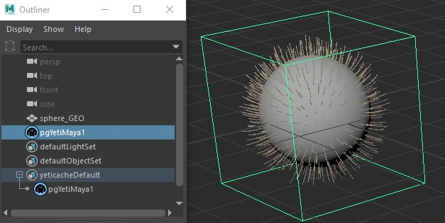
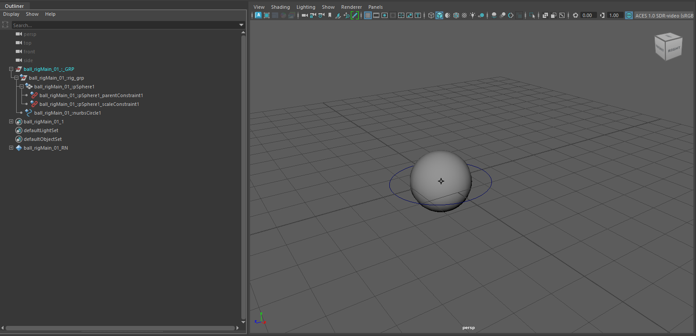
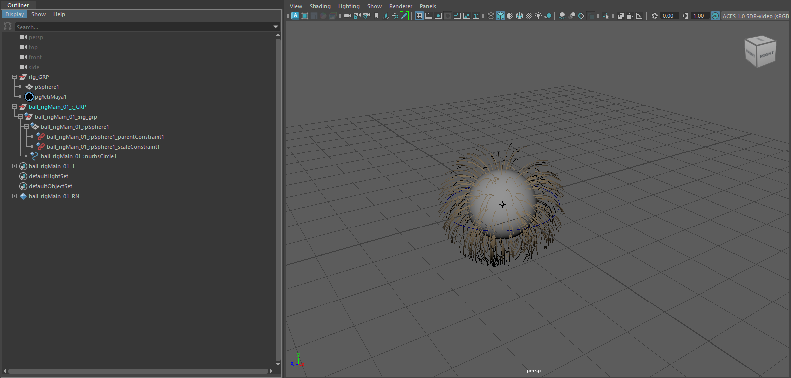
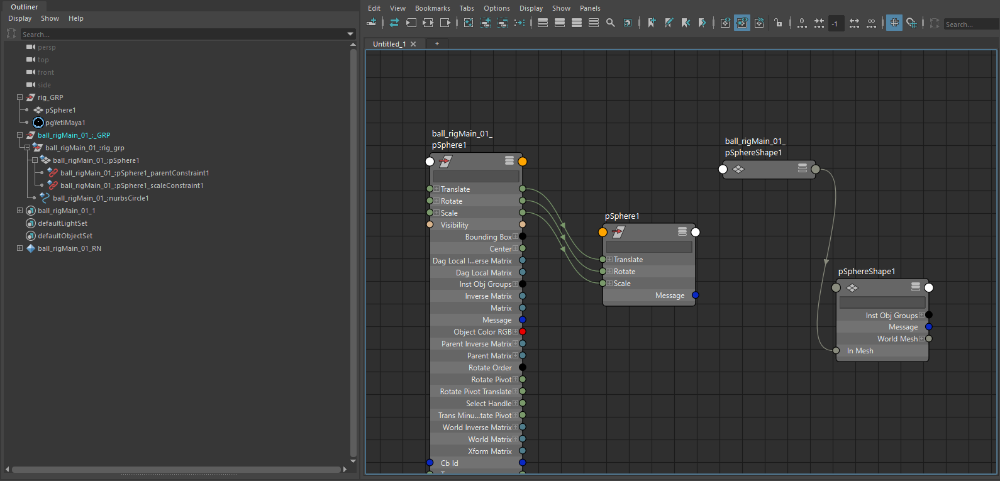
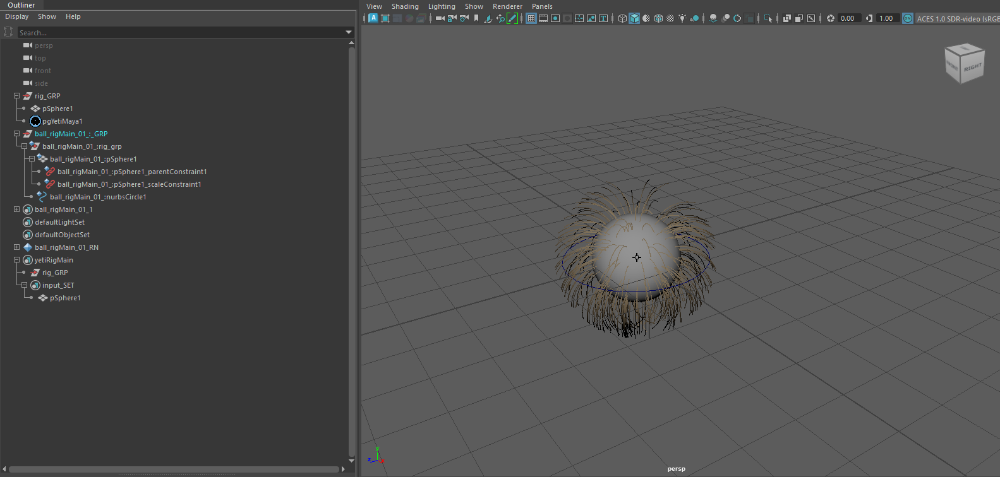
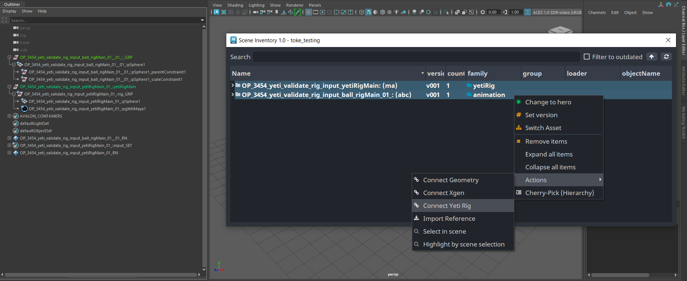

## Working with Yeti in OpenPype

OpenPype can work with [Yeti](https://peregrinelabs.com/yeti/) in two data modes.
It can handle Yeti caches and Yeti rigs.

## Yeti Caches

### Creating and publishing

Let start by creating simple Yeti setup, just one object and Yeti node. Open new
empty scene in Maya and create sphere. Then select sphere and go **Yeti → Create Yeti Node on Mesh**
Open Yeti node graph **Yeti → Open Graph Editor** and create setup like this:


It doesn't matter what setting you use now, just select proper shape in first
*Import* node. Select your Yeti node and create *Yeti Cache instance* - **OpenPype → Create...**
and select **Yeti Cache**. Leave `Use selection` checked. You should end up with this setup:



You can see there is `yeticacheDefault` set. Instead of *Default* it could be named with
whatever name you've entered in `subset` field during instance creation.

We are almost ready for publishing cache. You can check basic settings by selecting
Yeti cache set and opening *Extra attributes* in Maya **Attribute Editor**.


Those attributes there are self-explanatory, but:

- `Preroll` is number of frames simulation will run before cache frames are stored.
This is useful to "steady" simulation for example.
- `Frame Start` from what frame we start to store cache files
- `Frame End` to what frame we are storing cache files
- `Fps` of cache
- `Samples` how many time samples we take during caching

You can now publish Yeti cache as any other types. **OpenPype → Publish**. It will
create sequence of `.fur` files and `.fursettings` metadata file with Yeti node
setting.

:::note Collect Yeti Cache failure
If you encounter **Collect Yeti Cache** failure during collecting phase, and the error is like
```fix
No object matches name: pgYetiMaya1Shape.cbId
```
then it is probably caused by scene not being saved before publishing.
:::

### Loading

You can load Yeti cache by **OpenPype → Load ...**. Select your cache, right+click on
it and select **Load Yeti cache**. This will create Yeti node in scene and set its
cache path to point to your published cache files. Note that this Yeti node will
be named with same name as the one you've used to publish cache. Also notice that
when you open graph on this Yeti node, all nodes are as they were in publishing node.

## Yeti Rigs

### Creating and publishing

Yeti Rigs are designed to connect to published models or animation rig. The workflow gives the Yeti Rig full control on that geometry to do additional things on top of whatever input comes in, e.g. deleting faces, pushing faces in/out, subdividing, etc.

Let's start with a [model](artist_hosts_maya.md#loading-model) or [rig](artist_hosts_maya.md#loading-rigs) loaded into the scene. Here we are using a simple rig.



We'll need to prepare the scene a bit. We want some Yeti hair on the ball geometry, so duplicating the geometry, adding the Yeti hair and grouping it together.



Now we need to connect the Yeti Rig with the animation rig. Yeti Rigs work by publishing the attribute connections from its input nodes and reconnect them later in the pipeline. This means we can only use attribute connections to get the animation from the rig to the Yeti Rig. Constraints or blendshapes are not supported. We'll connnect the Yeti Rig geometry to the animation rig, with the transform and mesh attributes.



Now we are ready for publishing. Select the Yeti Rig group (`rig_GRP`) and
create *Yeti Rig instance* - **OpenPype → Create...** and select **Yeti Rig**.
Leave `Use selection` checked.

Last step is to add our geometry to the rig instance, so middle+drag its
geometry to `input_SET` under the `yetiRigMain` set representing rig instance.
Note that its name can differ and is based on your subset name.



You can have any number of nodes in the Yeti Rig, but only nodes with incoming attribute connections from outside of the Yeti Rig hierarchy is needed in the `input_SET`.

Save your scene and ready for publishing our new simple Yeti Rig!

Go to publish **OpenPype → Publish** and run. This will publish rig with its geometry
as `.ma` scene, save Yeti node settings and export one frame of Yeti cache from
the beginning of your timeline. It will also collect all textures used in Yeti
node, copy them to publish folder `resource` directory and set *Image search path*
of published node to this location.

### Loading

You can load published Yeti Rigs in OpenPype with **OpenPype → Load ...**,
select you Yeti rig and right+click on it. In context menu you should see
**Load Yeti Rig** item (among others).

To connect the Yeti Rig with published animation, we'll load in the animation and use the Inventory to establish the connections.



The Yeti Rig should now be following the animation :tada:
