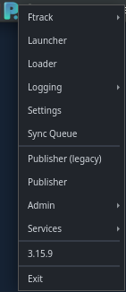

# Tray

Click on the **OpenPype** logo to open the tray and find the major informations about your account and especially your studio files .

## Ftrack

### Credentials
The **Credentials** contains the studio's **Ftrack URL**, your **Username** and the **API Key** given by your studio.

### Action server
Delete or stop [Action](manager_ftrack_actions.md) server.

 

### Open Ftrack
Access to **Ftrack**'s website and sign in.

## Launcher
Select your working context. Once choosen, you can see all the files, assets and its associated **Tasks**. You can also filter your assets for a more efficient research. Click on a task and select one of the softwares to open it.

## Loader
Loader loads published subsets into your current scene or script.
More details [here](artist_tools_loader).

## Logging
Shows informations about the logs on OpenPype.

## Settings
OpenPype stores some of it's settings and configuration in local file system. These settings are specific to each individual machine and provides the mechanism for local overrides
More details [here](admin_settings_local).

## Publisher (legacy)
Publish files without opening a software. More details [here](pype2/admin_presets_plugins.md#extractreview).

## Publisher
Publish files without opening a software.

## Admin

### Studio Settings
Details [here](admin_settings_system.md).

### Project Manager
Find here your projects library and there informations. You can add new projects, starting folders, assets and tasks, or delete them.

### Console
OpenPype console.

## Services

## OpenPype version
Gives informations about your **OpenPype** version, your **Workstation**, the **Local settings** and your **Environments**.

## Exit
Close OpenPype.
